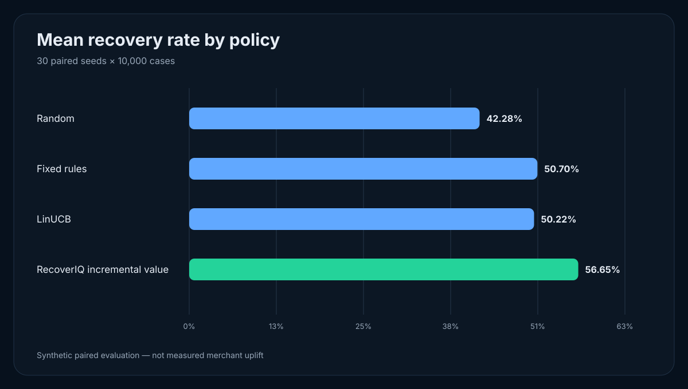
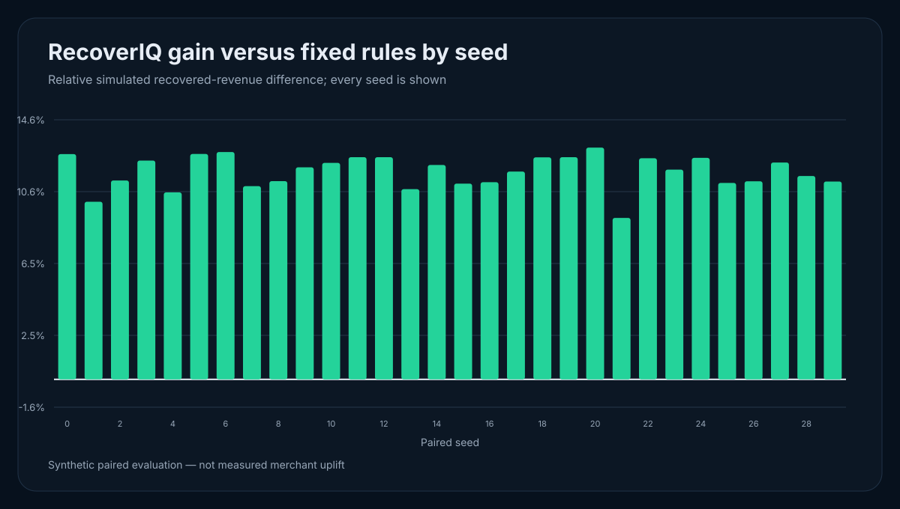
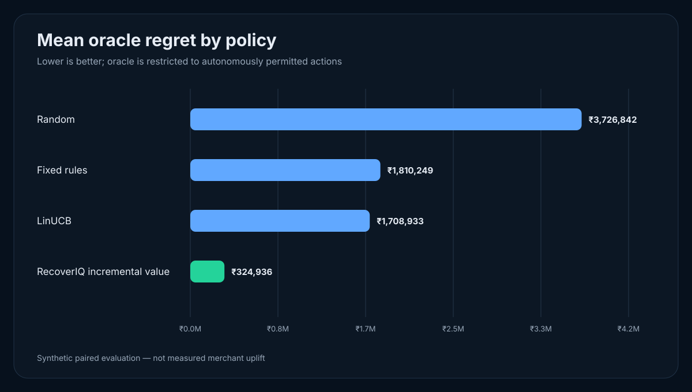

# Day 8 — Frozen Final Experiments

## Outcome

RecoverIQ now has a frozen, reproducible large-scale benchmark and committed
reviewer charts. The final run evaluates four policies on 30 paired seeds with
10,000 synthetic failed-payment cases per seed.

The incremental-value policy beats fixed rules on all 30 seeds. Its mean
relative simulated recovered-revenue gain is **11.697%**, with a paired 95%
confidence interval of **11.350% to 12.043%**. This is a synthetic engineering
result, not measured merchant uplift.

## Frozen configuration

The source of truth is `experiments/configs/day8_final.json`.

| Setting | Frozen value |
|---|---:|
| Benchmark ID | `recoveriq-day8-final-v1` |
| Evaluation cases per seed | 10,000 |
| Paired seeds | 30 (`0` through `29`) |
| Policies | Random, Fixed Rules, LinUCB, Incremental Value |
| LinUCB alpha | 0.8 |
| Logged-history cases | 6,000 |
| Logged-history seed | 20,260,829 |
| Offline epochs | 4 |
| Confidence interval | 95% Student-t |
| Data | Synthetic only |

Canonical configuration SHA-256:

```text
3b739c1beef6874a5d6b245e8292a556976dbaa2a308dcfcd6fd74b68446558b
```

Changing JSON key order does not change the digest. The Day 8 runner validates
the settings before execution and rejects a seed count below 30.

## Final results

### Policy-level means

| Policy | Recovery rate | Recovered revenue / seed | Oracle regret / seed |
|---|---:|---:|---:|
| Random | 42.282% | ₹10,791,810.57 | ₹3,726,842.48 |
| Fixed Rules | 50.703% | ₹12,712,600.95 | ₹1,810,249.33 |
| LinUCB | 50.217% | ₹12,811,699.79 | ₹1,708,932.59 |
| RecoverIQ Incremental Value | **56.649%** | **₹14,198,258.51** | **₹324,936.43** |

The oracle is evaluator-only and can choose only autonomously permitted actions.
It is never exposed to policy selection or learning.

### Paired comparison against fixed rules

| Metric | RecoverIQ Incremental Value | LinUCB |
|---|---:|---:|
| Mean additional simulated recovered revenue | ₹1,485,657.56 | ₹99,098.84 |
| 95% interval, additional revenue | ₹1,446,037.66 to ₹1,525,277.47 | -₹20,437.52 to ₹218,635.19 |
| Mean relative gain | **11.697%** | 0.788% |
| 95% interval, relative gain | **11.350% to 12.043%** | -0.160% to 1.737% |
| Seed wins | **30/30** | 19/30 |
| Negative seeds | **0/30** | 11/30 |
| Directional claim | `INCREMENTAL_VALUE_AHEAD` | `INCONCLUSIVE` |

The LinUCB result is intentionally reported as inconclusive because its paired
interval crosses zero. Its 11 negative seeds are retained in the final JSON.

### Variability and calibration

- Incremental-value relative gain: median 11.875%, standard deviation 0.929
  percentage points, range 9.090% to 13.050%, IQR 11.110% to 12.492%.
- Selected-action probability MAE: 5.166 percentage points.
- Selected-outcome Brier score: 0.2212.
- Zero negative RecoverIQ seeds is an observed property of this frozen run,
  not a guarantee outside RecoveryGym.

## Charts







Every seed appears in the seed-gain chart. The chart generator uses only the
committed report, produces deterministic SVG, includes accessible title and
description elements, and labels the evidence as synthetic.

## Negative-seed analysis

RecoverIQ has no negative seed in the frozen evaluation. The weakest seed is
seed 21 at a 9.090% relative gain; the strongest is seed 20 at 13.050%.

LinUCB loses to rules on seeds 1, 3, 7, 12, 13, 14, 20, 21, 26, 28 and 29. Its
worst relative result is -4.650% on seed 12. This instability is why the final
pitch should lead with the incremental-value policy rather than the cold-start
contextual bandit.

## Limitations

1. Customers, amounts, failures and responses are synthetic.
2. Logged-history warm-start data is produced by RecoveryGym, not merchant traffic.
3. Paired potential outcomes improve evaluation precision but do not establish external validity.
4. The simulator cannot represent every Razorpay product-eligibility rule or operational failure.
5. The results do not prove causal uplift for a real merchant.
6. A Test Mode demo validates integration behavior, not model effectiveness.

## Reproduce

```bash
python -m experiments.run_day8_final
```

The command validates the frozen configuration, runs the 30-seed benchmark,
writes `outputs/day8_final_10k_x_30.json`, and regenerates all three SVG charts.

For the ordinary smoke runner, worker count can be changed without changing
results:

```bash
python -m experiments.run_multiseed --events 100 --seeds 3 --workers 2 \
  --output /tmp/recoveriq_smoke.json
```

## Submission-safe claim

> Across 30 paired synthetic seeds with 10,000 cases each, RecoverIQ's
> incremental-value policy recovered 11.70% more simulated revenue than fixed
> rules on average (95% CI: 11.35%–12.04%) and won all 30 seeds. These are
> simulator results, not measured merchant uplift.
