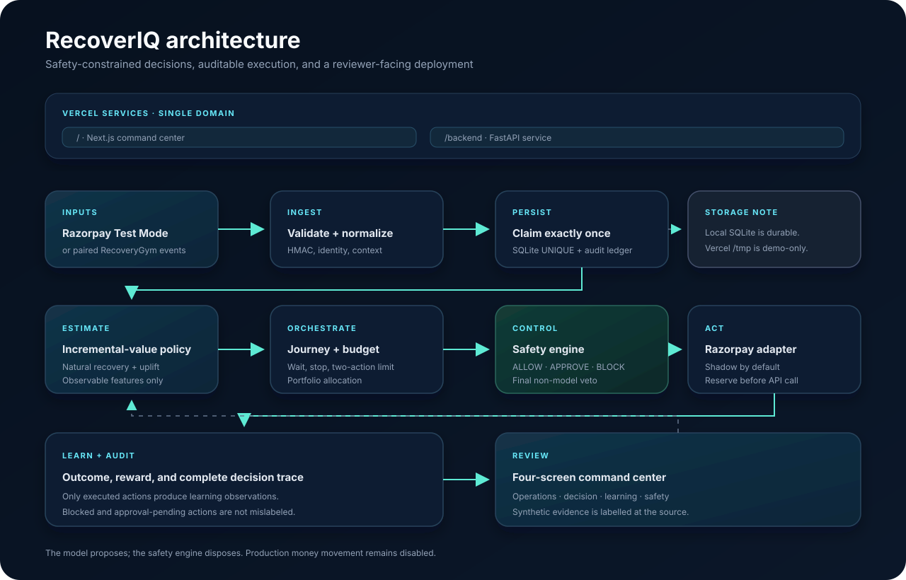

# RecoverIQ setup and deployment

RecoverIQ runs as two independently deployable Vercel projects:

| Project | Runtime | Purpose |
| --- | --- | --- |
| `recoveriq-dashboard` | Next.js / Node.js 22 | Reviewer command center and synthetic dashboard read model |
| `recoveriq-api` | FastAPI / Python 3.12 | Health, readiness, simulation, and signed Razorpay webhook endpoints |

The dashboard project uses `frontend/` as its project root. The API project uses
the repository root and discovers `main:app` through the root `pyproject.toml`.
Keeping the runtimes separate avoids coupling a dashboard release to the Python
function build.



## Local setup

Requirements: Python 3.12, Node.js 22.13 or newer, and npm 10 or newer.

```bash
python -m venv .venv
source .venv/bin/activate
pip install -r requirements.txt -r requirements-dev.txt
cd frontend
npm ci
npm run lint
npm test
cd ..
python -m pytest -q
python -m scripts.check_repo_hygiene
```

On Windows, activate with `.venv\Scripts\activate`. Run the API with
`uvicorn backend.app.main:app --reload` and the dashboard with `npm run dev`
from `frontend/`.

## Seed deterministic demo data

The seed command creates a synthetic SQLite ledger through the real integration
service in shadow mode. It makes zero Razorpay network calls.

```bash
python -m scripts.seed_demo_data \
  --database data/recoveriq-demo.sqlite3 \
  --cases 12 \
  --seed 42 \
  --output outputs/day9_demo_seed_summary.json
```

The command resets the target ledger by default, so the same seed and case count
produce the same rows and summary. Pass `--append` only to demonstrate duplicate
event handling. SQLite files remain ignored and must not be committed.

## Safe environment baseline

Copy `.env.example` to `.env` locally. For a reviewer deployment, leave all
Razorpay secret values unset and retain:

```dotenv
RECOVERIQ_MODE=shadow
RECOVERIQ_EXECUTE_RAZORPAY_ACTIONS=false
```

Secret values belong in Vercel Project Settings, never in GitHub. Required names
are `DATABASE_URL`, `RAZORPAY_KEY_ID`, `RAZORPAY_KEY_SECRET`, `RAZORPAY_WEBHOOK_SECRET`,
`RECOVERIQ_MODE`, `RECOVERIQ_EXECUTE_RAZORPAY_ACTIONS`,
`RECOVERIQ_AUTONOMOUS_LIMIT_PAISE`, and `RECOVERIQ_DATABASE_PATH`.

Set `DATABASE_URL` on the `recoveriq-api` Vercel project to the pooled Neon
connection string. The backend selects Postgres whenever this variable exists.
If it is absent on Vercel, health and simulation routes remain available but the
signed webhook route fails closed with `503` rather than writing to `/tmp`.
Local development continues to use `RECOVERIQ_DATABASE_PATH` by default.

## Vercel deployment

Create two projects in the intended Vercel team:

1. `recoveriq-dashboard`: root directory `frontend`, Framework Preset **Next.js**.
2. `recoveriq-api`: repository root, Framework Preset **FastAPI**.
3. Keep the Razorpay values unset and the execution switch false in the API
   project until a genuine Test Mode exercise.
4. Add the pooled Neon `DATABASE_URL` to the API project's Production scope.
5. Create previews from the same `main` commit and verify both before promotion:

```bash
vercel curl / --deployment <dashboard-preview-url>
vercel curl /api/dashboard --deployment <dashboard-preview-url>
vercel curl /health --deployment <api-preview-url>
vercel curl /health/database --deployment <api-preview-url>
vercel curl /readiness --deployment <api-preview-url>
```

`/health/database` performs a real `SELECT 1` against the configured recovery
ledger and returns only backend type and reachability. It never exposes a
connection string or database error details.

Expected readiness in the safe reviewer configuration is `degraded`: the API is
healthy while Razorpay webhook credentials are intentionally absent. Promote the
exact verified artifacts with `vercel promote <preview-url>`.

Current public production aliases:

- `https://recoveriq-dashboard-prajwal-ai.vercel.app`
- `https://recoveriq-api.vercel.app`

Both aliases are intentionally public for reviewers. The source repository
remains private; public deployment access does not expose repository contents.

The GitHub repository remains private. Vercel only needs repository installation
access for builds; no source visibility change is required.

## Repository hygiene

`python -m scripts.check_repo_hygiene` runs in CI and rejects tracked environment
files, databases, private keys, common live-token signatures, or missing ignore
rules for local state and Vercel metadata. Never paste secret values into build
logs, issues, screenshots, or documentation.
